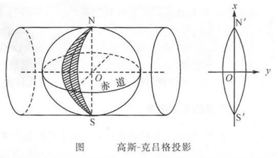
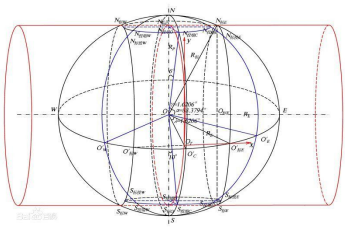
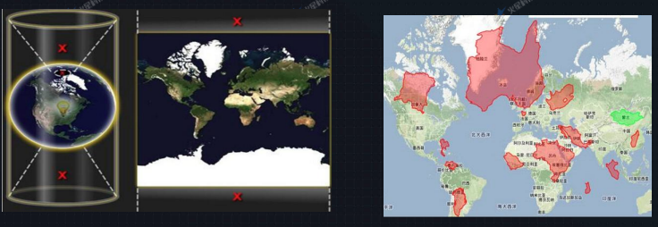
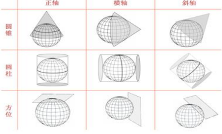
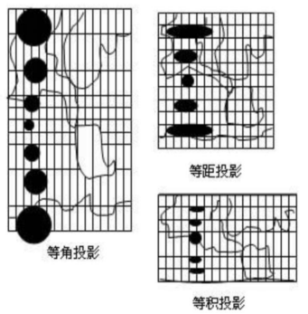
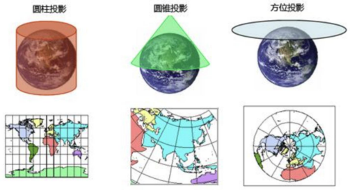
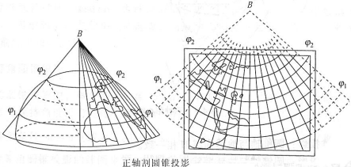
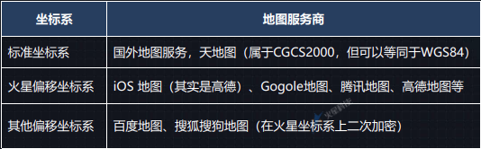

# GIS基础知识
## GIS概论和体系
- GIS：地理信息系统
- 应用领域：何时何地何事
- 应用价值：呈现还原规划，数据挖掘统计分析
- `OGC标准`：开放地理空间信息联盟
    - 扩展:[cesium调用OGC服务](https://zhuanlan.zhihu.com/p/156925375)

- GIS平台：ESRI ArcGIS，SuperMap，SKyline，开源GIS
- 开源GIS常用产品
    1. 地图数据产生 uDig
    2. 地图适量数据存储 PostGIS
    3. 地图瓦片数据存储 MongoDB
    4. web服务器 Tomcat
    5. GiS服务器 GeoServer
    6. 组件开发 GeoTools
    7. web客户端呈现 Leaflet或Cesium 
- GIS体系结构：
    1. 客户端（应用层）ArcGIS Desktop GIS工程师
    2. 服务 GIS服务器，GeoServer，nginx（瓦片等静态资源）GIS工程师
    3. 数据（文件格式数据，数据库SDE数据，互联网在线资源）软件工程师

## GIS坐标系
- 地球非标准椭圆，表面崎岖不平
- 地球空间模型：大地椭球体，大地水准面
- 坐标系概览
    1. 原点与质心关系：参心大地坐标系（已淘汰），地心大地坐标系（目前通用）
    2. 表现形式：
        1. 地理坐标系GCS：LBH，XYZ，
        2. 投影坐标系PCS（XYH，PCS=GCS+投影方式）：
1. 高斯-克吕格投影：（横轴等角切圆柱投影，横轴墨卡托投影）Y（赤道方向前需加投影带号）

2. 通用横轴墨卡托投影（UTM）：（横轴等角割椭圆柱面投影）与椭圆柱割地球与S80°，N84°，相割经线上五边形，中央经线上长度比0.9996（0.9996高斯投影）

3. 墨托卡投影：（等角正切圆柱投影）：经线间距相等，纬度越高面积放大倍数越大

4. web墨卡托投影：正方形地图，y轴取值范围限定在x轴相同范围（纬度范围±85°）
### 投影坐标系PCS
球面坐标不方便进行距离，方位，面积等参数的量算和各种控件分析，不存在完全无误差的地图

- 常用投影
1. 中国地形图投影：Lamber
    - （正轴等角割圆锥投影）
2. 各省市：Albers
3. 城市及或小范围区域（规划局，国土局，建设局，工程报建）：局部高斯
4. 互联网公众地图网站：web墨卡托
5. 卫星影像数据：UTM
### 当前通用的坐标系标准
国际
- WGS84（EPSG4326）
    1. 目前最通用标准坐标系，国际协议地球参考系统（ITRS），国际上统一采用的大地坐标系，GPS以此为准
国内
- 1985国家高程基准
    1. 建立统一的高程基准面
- （已弃用参心坐标系）：北京54，西安80（但很多旧数据仍是此坐标系）
- 2000国家大地坐标系（CGCS2000）（EDSG4490）
    1. 全球底薪坐标系在中国具体体现，与WGS84误差厘米级，一般工程测量可认为一致
- 火星坐标系（GCJ-02）国家安全加密坐标系

### 坐标系转换
主要是GCS转GCS，GCS转PCS就是投影，PCS转PCS就是重投影
- GCS转GCS：仿射变换（平移，旋转，缩放（无顺序））
- 七参数法（X，Y，Z平移，旋转；尺度变化K）
- 平面转换（四参数法，平面网格拟合）
### 常见概念
1. 经纬网，方里网（公里网）
2. 比例尺(Scale)，分辨率(Resolution)（当前地图范围内，1像素代表多少地图单位，与dpi和地图单位有关）
3. WKID（GIS坐标系ID），EPSG管理该ID号
    常见EPSG:
    1. EPSG4326 WGS84
    2. EPSG4490 CGCS2000
    3. EPSG3857 Web Mercator

## GIS数据
