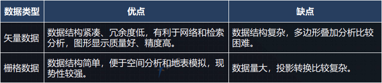

# GIS基础知识
## GIS概论和体系
- GIS：地理信息系统
- 应用领域：何时何地何事
- 应用价值：呈现还原规划，数据挖掘统计分析
- `OGC标准`：开放地理空间信息联盟
    - 扩展:[cesium调用OGC服务](https://zhuanlan.zhihu.com/p/156925375)

- GIS平台：ESRI ArcGIS，SuperMap，SKyline，开源GIS
- 开源GIS常用产品
    1. 地图数据产生 uDig
    2. 地图适量数据存储 PostGIS
    3. 地图瓦片数据存储 MongoDB
    4. web服务器 Tomcat
    5. GiS服务器 GeoServer
    6. 组件开发 GeoTools
    7. web客户端呈现 Leaflet或Cesium 
- GIS体系结构：
    1. 客户端（应用层）ArcGIS Desktop GIS工程师
    2. 服务 GIS服务器，GeoServer，nginx（瓦片等静态资源）GIS工程师
    3. 数据（文件格式数据，数据库SDE数据，互联网在线资源）软件工程师

## GIS坐标系
- 地球非标准椭圆，表面崎岖不平
- 地球空间模型：大地椭球体，大地水准面
- 坐标系概览
    1. 原点与质心关系：参心大地坐标系（已淘汰），地心大地坐标系（目前通用）
    2. 表现形式：
        1. 地理坐标系GCS：LBH，XYZ，
        2. 投影坐标系PCS（XYH，PCS=GCS+投影方式）：
1. 高斯-克吕格投影：（横轴等角切圆柱投影，横轴墨卡托投影）Y（赤道方向前需加投影带号）

2. 通用横轴墨卡托投影（UTM）：（横轴等角割椭圆柱面投影）与椭圆柱割地球与S80°，N84°，相割经线上五边形，中央经线上长度比0.9996（0.9996高斯投影）

3. 墨托卡投影：（等角正切圆柱投影）：经线间距相等，纬度越高面积放大倍数越大

4. web墨卡托投影：正方形地图，y轴取值范围限定在x轴相同范围（纬度范围±85°）
### 投影坐标系PCS
球面坐标不方便进行距离，方位，面积等参数的量算和各种控件分析，不存在完全无误差的地图

- 常用投影
1. 中国地形图投影：Lamber
    - （正轴等角割圆锥投影）
2. 各省市：Albers
3. 城市及或小范围区域（规划局，国土局，建设局，工程报建）：局部高斯
4. 互联网公众地图网站：web墨卡托
5. 卫星影像数据：UTM

### 当前通用的坐标系标准
国际
- WGS84（EPSG4326）
    1. 目前最通用标准坐标系，国际协议地球参考系统（ITRS），国际上统一采用的大地坐标系，GPS以此为准

国内
- 1985国家高程基准
    1. 建立统一的高程基准面
- （已弃用参心坐标系）：北京54，西安80（但很多旧数据仍是此坐标系）
- 2000国家大地坐标系（CGCS2000）（EDSG4490）
    1. 全球底薪坐标系在中国具体体现，与WGS84误差厘米级，一般工程测量可认为一致
- 火星坐标系（GCJ-02）国家安全加密坐标系

### 坐标系转换
主要是GCS转GCS，GCS转PCS就是投影，PCS转PCS就是重投影
- GCS转GCS：仿射变换（平移，旋转，缩放（无顺序））
- 七参数法（X，Y，Z平移，旋转；尺度变化K）
- 平面转换（四参数法，平面网格拟合）
### 常见概念
1. 经纬网，方里网（公里网）
2. 比例尺(Scale)，分辨率(Resolution)（当前地图范围内，1像素代表多少地图单位，与dpi和地图单位有关）
3. WKID（GIS坐标系ID），EPSG管理该ID号
    常见EPSG:
    1. EPSG4326 WGS84
    2. EPSG4490 CGCS2000
    3. EPSG3857 Web Mercator

## GIS数据
### 地图数据结构
由不同图层（Layers）构成：
- 二维：栅格地图图层，矢量图层
- 三维：地形图层，栅格地图图层，三维模型层，矢量图层

图层内数据分为：

- 矢量数据：
    1. 点线面形式表达，定位明显，属性隐含，数据结构紧凑，冗余度第，表达精度高
    2. 要素（Feature）:点（LBH），线（多个点），面（一条或多条闭合线）数据，由坐标，样式，属性组成
    
    
    3. 属性信息:名称，备注等
    

- 栅格数据：
    1. （瓦片模型），定位隐含，属性明显，最有效的压缩编码方式：四叉树编码，能提高图形操作效率，具有可变分辨率
    2. 瓦片地图金字塔模型：瓦片分辨率256x256，最小地图等级是0,具有瓦片等级（Z）和瓦片行列坐标编号（X，Y），由低一级瓦片切割成4个瓦片组成
    

### GIS数据的生产和来源
1. 数据生产
- 测绘，对显示世界进行抽象得到概念模型，进而转换为逻辑和物理模型
- 人工建模：3DMax，Maya人工建模，Revit BIM建模
- 仪器仪表实地测绘： 精度，置信度，准确度高
- 航拍：高精度航空照片，卫星照片，遥感照片，作为底片人为矢量标注和勾勒形成矢量数据，或专业GIS软件制作成DOM影像地图
- 其他： 数据供应商或政府部门，实拍街景
2. 数据来源选择
- 测绘局， 商业图商（有自由格式，部分不开放），互联网公开资源（通用自由格式）

### 常见文件格式
- .tif 栅格图像文件
    - OGC规范之一，需要用GIS软件查看，坐标系信息写在数据文件内部，真彩24位深度，地形8位深度
    - 卫星影像数据，地形数据等

- .dem 空间数据交换格式
    - NSDTF-DEM（中国，网格数据交换格式，一般GIS软件不支持）
    - USGS-DEM（美国，公开格式）

- .shp 工业标准矢量数据文件
    - 空间特征表中的非拓扑几何对象（以坐标点集形式.shp存储）和属性信息
    - 包含主文件（.shp 不包含拓扑数据结构)，索引文件（.shx），dBASE表（.dbf）
    - 一个shp只能存点线面中的一种
    - shp可设置很多字段

- .kml/.kmz
    - 基于xml，使用网络环境GIS协作共享，最新版本成为OGC标准，
    - kml + 关联的图片，模型等其他文件 =压缩=> kmz

- .dwg/.dxf
    - dwg：AutoCAD平台图像文件格式，二维或三维图像档案，可与dxf互转
    - dxf：AutoCAD与其他平台数据交换的开放格式，CAD系统事实标准

- GeoJSON(.json)
    - 适合web的地理数据结构编码格式
    - 地理要素分为Point，MultPoint，LineString，MultLineString，Polygon，MultiPolygon，GeometryCollection
    - 格式：要付封装到单个geometry里，然后作为单个feature放到集合中
    

- WKT(.wkt)
    - 标记语言，文本描述点线面，坐标系统的定义，出自OGC
    - 二进制存储格式：WKB

- OSGB(倾斜摄影)
    - 二进制，带有嵌入式链接纹理数据（.jpg）
    - ContextCapture Cente处理的倾斜摄影三维模型数据组织使用

- .obj(人工建模)
    - 标准3D模型文件格式，万能格式
    - 包含obj，mtl，纹理图片

### 数据生产到应用举例
- 无人机航拍：采集，设置航线，拍摄结束导出pos信息视频，使用处理软件处理

### GIS数据存储
业务数据：MySQL等
栅格数据：MongoDB
矢量数据：PostGIS
- 少量数据时，无需编辑的矢量文件可直接存硬盘文件夹，业务数据库相关表中加入L，B，H字段后，直接存在数据库中

## GIS服务
- 在网络环境下的一组与地理信息相关的软件功能示例，通过接口暴露封装的GIS功能

### 常用服务：
1. ArcGIS Server
    - MapServer瓦片服务，MapServer动态服务，FeatureServer矢量服务

2. GeoServer
    - OpenGIS Web 服务器规范的J2EE实现，可以方便发布地图数据
    - OGC标准WMS，WMTS，WFS（常用GeoServer发布）
    - WMS（web map service）网络地图服务，将数据源转换成图片，可放大缩小
    - WMTS（web map tile service）网络地图切片服务，比WMTS快但不灵活
        - TMS（tiled map service）切片是正方形，WMTS可以是矩形，金字塔横纵坐标相反
    - WFS（web feature service）网络要素服务，提供矢量图形，缩放不失真，方便交互编辑等

3. 静态资源数据服务（web容器发布）
    - 瓦片地图，terrain地形，3dtiles三维模型等
    - 除了GIS服务器也可以用http容器（IIS，Tomcat，Nginx，Node等）发布，简单方便效率高

4. 互联网在线地图服务（实时性高，服务全面）
    - 国际：google（唯一全能），mapbox，bing，argis online
    - 国内：天地图（国家测绘局，OGC标准），高德（GCJ-02）百度（BD-09）腾讯等

### 项目中GIS服务发布
- Nginx：离线底图，terrain，3dtiles三维模型等
- GeoServer：矢量数据
- 互联网在线地图服务：直接使用其底图服务，Web查询服务（在线环境）

## GIS应用开发
客户端应用（核心部分）
开发框架分类：
- 专业商业GIS：ArcGIS，SuperMap，Skyline等
- 在线图商公众SDK：百度，高德，天地图，google，Mapbox
- 开源GIS：Openlayers，MapboxGL，Leaflet，Cesium等

### Leaflet 二维地图开发框架
js，轻量，移动端友好，简单易懂，插件丰富 
- [mars2d](http://mars2d.cn)

### Cesium 三维地球开发框架
js，基于WebGL（js借助GPU呈现3D场景和对象，跨平台跨浏览器（web前端+图形学+GIS）
- [mars3d](http://mars2d.cn)

## GIS发展与未来
- 国家各方面管理领域，金融等
- 倾斜摄影测量，定位技术，空间信息扩展，跨行业数据透视，APP
- 云GIS，BIM+GIS+VR/AR，数字孪生
