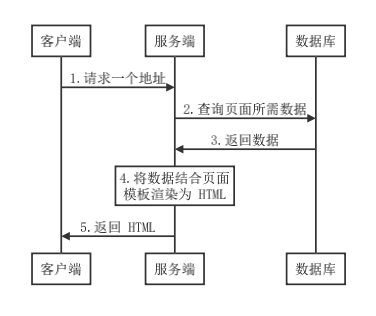
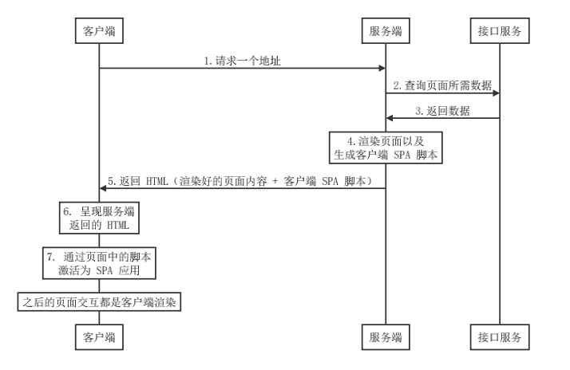
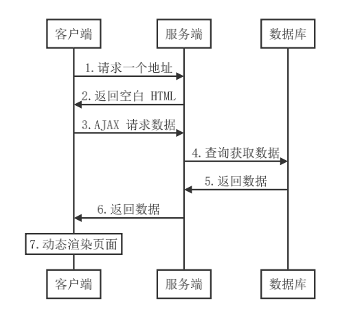
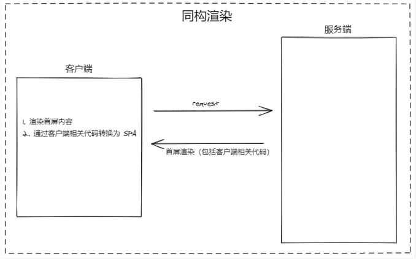
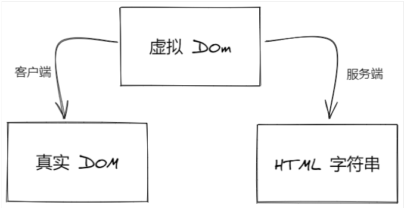

# 服务端渲染基础

## 概述

随着前端技术栈和工具链的迭代成熟，前端工程化、模块化也已成为了当下的主流技术方案，在这波前端技术浪潮中，涌现了诸如 React、Vue、Angular 等基于客户端渲染的前端框架，这类框架所构建的单页应用（SPA）具有用户体验好、渲染性能好、可维护性高等优点。但也也有一些很大的缺陷，其中
主要涉及到以下两点：

（ 1 ）首屏加载时间过长

与传统服务端渲染直接获取服务端渲染好的 HTML 不同，单页应用使用 JavaScript 在客户端生成 HTML 来呈现内容，用户需要等待客户端 JS 解析执行完成才能看到页面，这就使得首屏加载时间变长，从而影响用户体验。

（ 2 ）不利于 SEO

当搜索引擎爬取网站 HTML 文件时，单页应用的 HTML 没有内容，因为他它需要通过客户端 JavaScript 解析执行才能生成网页内容，而目前的主流的搜索引擎对于这一部分内容的抓取还不是很好。

为了解决这两个缺陷，业界借鉴了传统的服务端直出 HTML 方案，提出在服务器端执行前端框架（React/Vue/Angular）代码生成网页内容，然后将渲染好的网页内容返回给客户端，客户端只需要负责展示就可以了；


当然不仅仅如此，为了获得更好的用户体验，同时会在客户端将来自服务端渲染的内容激活为一个 SPA 应用，也就是说之后的页面内容交互都是通过客户端渲染处理。


#### 这种方式简而言之就是：

- 通过服务端渲染首屏直出，解决首屏渲染慢以及不利于 SEO 问题
- 通过客户端渲染接管页面内容交互得到更好的用户体验

这种方式我们通常称之为现代化的服务端渲染，也叫同构渲染，所谓的同构指的就是服务端构建渲染 + 客户端构建渲染。同理，这种方式构建的应用称之为服务端渲染应用或者是同构应用。

为了让大家更好的理解服务端渲染应用，我们这里需要了解一些渲染相关概念，这些概念主要涉及到以下几点：

- 什么是渲染
- 传统的服务端渲染
- 客户端渲染
- 现代化的服务端渲染（同构渲染）

## 什么是渲染

我们这里所说的渲染指的是 把（数据 + 模板）拼接到一起 的这个事儿。

例如对于我们前端开发者来说最常见的一种场景就是：请求后端接口数据，然后将数据通过模板绑定语法绑定到页面中，最终呈现给用户。这个过程就是我们这里所指的渲染。

渲染本质其实就是字符串的解析替换，实现方式有很多种；但是我们这里要关注的并不是如何渲染，而是在哪里渲染的问题？

## 传统的服务端渲染

最早期，Web 页面渲染都是在服务端完成的，即服务端运行过程中将所需的数据结合页面模板渲染为 HTML，响应给客户端浏览器。所以浏览器呈现出来的是直接包含内容的页面。

工作流程：

这种方式的代表性技术有：ASP、PHP、JSP，再到后来的一些相对高级一点的服务端框架配合一些模板引擎。

无论如何这种方式对于没有玩儿过后端开发的同学来说可能会比较陌生，所以下面通过我们前端同学比较熟悉的 Node.js 来了解一下这种方式。

安装依赖：

```shell
# 创建 http 服务
npm i express

# 服务端模板引擎
npm i art-template express-art-template

nodemon .\index.js #使用该方法启动可自动重启
```

#### 服务端代码：

- 基本的 Web 服务
- 使用模板引擎
- 渲染一个页面

```javascript
const express = require('express')
const fs = require('fs')
const template = require('art-template')
const app = express()

app.get('/', (req, res) => {
  // 1. 得到模板内容
  const templateStr = fs.readFileSync('./index.html', 'utf-8')

  // 2. 得到数据
  const data = JSON.parse(fs.readFileSync('./data.json', 'utf-8'))

  // 3. 渲染：数据 + 模板 = 完整结果
  const html = template.render(templateStr, data)

  console.log(html)

  // 4. 把渲染结果发送给客户端
  res.send(html)
})

app.listen(3000, () => console.log('running...'))
```

客户端代码：

```txt
<!DOCTYPE html>
<html lang="en">
  <head>
    <meta charset="UTF-8" />
    <title>Document</title>
  </head>
  <body>
    <h1>{{ message }}</h1>
    <ul>
      {{ each todos }}
      <li>{{ $value.title }}</li>
      {{ /each }}  // art-template 模板引擎语法
    </ul>
  </body>
</html>
```
这也就是最早的网页渲染方式，也就是动态网站的核心工作步骤。在这样的一个工作过程中，因为页面中的内容不是固定的，它有一些动态的内容。

在今天看来，这种渲染模式是不合理或者说不先进的。因为在当下这种网页越来越复杂的情况下，这种模式存在很多明显的不足：
- 应用的前后端部分完全耦合在一起，在前后端协同开发方面会有非常大的阻力；
- 前端没有足够的发挥空间，无法充分利用现在前端生态下的一些更优秀的方案；
- 由于内容都是在服务端动态生成的，所以服务端的压力较大；
- 相比目前流行的 SPA 应用来说，用户体验一般；

但是不得不说，在网页应用并不复杂的情况下，这种方式也是可取的。

## 客户端渲染

传统的服务端渲染有很多问题，但是这些问题随着客户端 Ajax 技术的普及得到了有效的解决，Ajax 技术可以使得客户端动态获取数据变为可能，也就是说原本服务端渲染这件事儿也可以拿到客户端做了。

下面是基于客户端渲染的 SPA 应用的基本工作流程。


下面我们以一个 Vue.js 创建的单页面应用为例来了解一下这种方式的渲染过程。

通过这个示例可以了解到我们就可以把【数据处理】和【页面渲染】这两件事儿分开了，也就是【后端】负责数据处理，【前端】负责页面渲染，这种分离模式极大的提高了开发效率和可维护性。

而且这样一来，【前端】更为独立，也不再受限制于【后端】，它可以选择任意的技术方案或框架来处理页面渲染。

但是这种模式下，也会存在一些明显的不足，其中最主要的就是：
- 首屏渲染慢：因为 HTML 中没有内容，必须等到 JavaScript 加载并执行完成才能呈现页面内容。
- SEO 问题：同样因为 HTML 中没有内容，所以对于目前的搜索引擎爬虫来说，页面中没有任何有用的信息，自然无法提取关键词，进行索引了。

对于客户端渲染的 SPA 应用的问题有没有解决方案呢？
- 服务端渲染，严格来说是现代化的服务端渲染，也叫同构渲染

## 现代化的服务端渲染

我们在上一小节了解到 SPA 应用有两个非常明显的问题：
- 首屏渲染慢
- 不利于 SEO

我们只是把问题抛出来了，那有没有解决办法呢？

答案就是：服务端渲染。

也就是将客户端渲染的工作放到服务端渲染，这个问题不就解决了吗？
但是有的同学肯定会想要问，是再让我们回到传统的服务端渲染吗？

不不不，本质上确实是需要使用到传统的服务端渲染，但是严格来讲应该叫现代化的服务端渲染，也叫同构渲染，也就是【服务端渲染】 + 【客户端渲染】。可能听起来有点晕，这个概念我们待会儿就会了解到。

接下来我要通过一个开箱即用的解决方案来带领大家了解一下什么是现代化的服务端渲染，或者说同构渲染。

Nuxt.js 是一个基于 Vue.js 生态开发的一个第三方服务端渲染框架，通过它我们可以轻松构建现代化的服务端渲染应用。

isomorphic web apps（同构应用）：isomorphic/universal，基于 react、vue 框架，客户端渲染和服务器端渲染的结合，在服务器端执行一次，用于实现服务器端渲染（首屏直出），在客户端再执行一次，用于接管页面交互，核心解决 SEO 和首屏渲染慢的问题。

1. 客户端发起请求
2. 服务端渲染首屏内容 + 生成客户端 SPA 相关资源
3. 服务端将生成的首屏资源发送给客户端
4. 客户端直接展示服务端渲染好的首屏内容
5. 首屏中的 SPA 相关资源执行之后会激活客户端 Vue
6. 之后客户端所有的交互都由客户端 SPA 处理

先来看一个例子：

交互流程解析：

分析优缺点：
- 优点：首屏渲染速度快、有利于 SEO
- 缺点：
  - 开发成本高。
  - 涉及构建设置和部署的更多要求。与可以部署在任何静态文件服务器上的完全静态单页面应用程序 (SPA) 不同，服务器渲染应用程序，需要处于 Node.js server 运行环境。
  - 更多的服务器端负载。在 Node.js 中渲染完整的应用程序，显然会比仅仅提供静态文件的 server 更加大量占用 CPU 资源 (CPU-intensive - CPU 密集)，因此如果你预料在高流量环境(high traffic) 下使用，请准备相应的服务器负载，并明智地采用缓存策略


#### 相关技术：
- React 生态中的 Next.js
- Vue 生态中的 Nuxt.js
- Angular 生态中的 Angular Universal

**实现原理：**

#### 服务端渲染的问题：
- 开发条件所限。浏览器特定的代码，只能在某些生命周期钩子函数 (lifecycle hook) 中使用；一些外部扩展库 (external library) 可能需要特殊处理，才能在服务器渲染应用程序中运行。
- 涉及构建设置和部署的更多要求。与可以部署在任何静态文件服务器上的完全静态单页面应用程序(SPA) 不同，服务器渲染应用程序，需要处于 Node.js server 运行环境。
- 更多的服务器端负载。在 Node.js 中渲染完整的应用程序，显然会比仅仅提供静态文件的 server更加大量占用 CPU 资源 (CPU-intensive - CPU 密集)，因此如果你预料在高流量环境 (high traffic)
下使用，请准备相应的服务器负载，并明智地采用缓存策略。

在对你的应用程序使用服务器端渲染 (SSR) 之前，你应该问的第一个问题是，是否真的需要它。这主要取决于内容到达时间 (time-to-content) 对应用程序的重要程度。例如，如果你正在构建一个内部仪表盘，初始加载时的额外几百毫秒并不重要，这种情况下去使用服务器端渲染 (SSR) 将是一个小题大作之
举。然而，内容到达时间 (time-to-content) 要求是绝对关键的指标，在这种情况下，服务器端渲染(SSR) 可以帮助你实现最佳的初始加载性能。

事实上，很多网站是出于效益的考虑才启用服务端渲染，性能倒是在其次。 假设 A 网站页面中有一个关键字叫“前端性能优化”，这个关键字是 JS 代码跑过一遍后添加到 HTML 页面中的。那么客户端渲染模式下，我们在搜索引擎搜索这个关键字，是找不到 A 网站的——搜索引擎只会查找现成的内容，不会帮
你跑 JS 代码。A 网站的运营方见此情形，感到很头大：搜索引擎搜不出来，用户找不到我们，谁还会用我的网站呢？为了把“现成的内容”拿给搜索引擎看，A 网站不得不启用服务端渲染。 但性能在其次，不代表性能不重要。