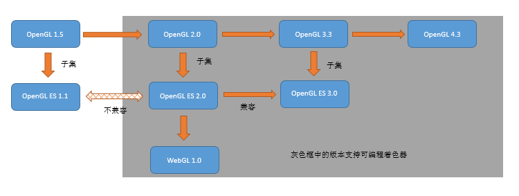
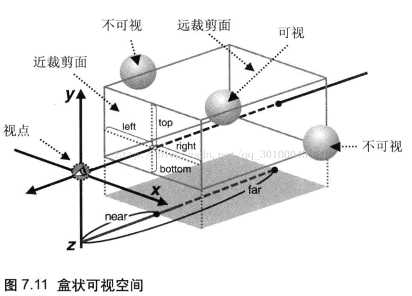
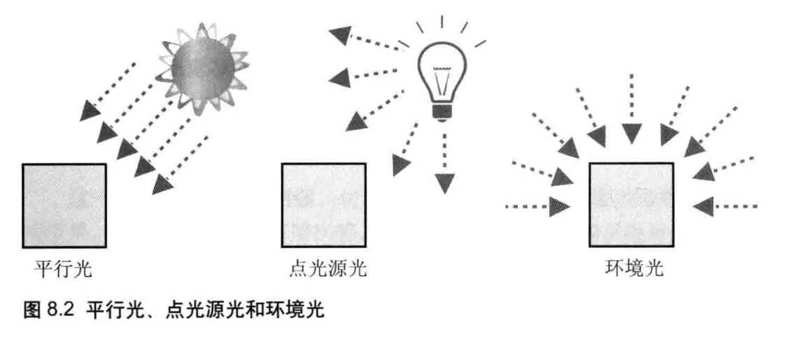

# WebGL学习笔记
## 1 WebGL概述
### WebGL的优势
1. 使用文本编辑器开发三维应用: WebGL内嵌在浏览器中，不需要常规开发工具(编译器，连接器等)
2. 轻松发布三维图形程序：不需要C一样编译，且非跨平台的可执行文件，WebGL只需要部署到Web服务器或当成文件分享
3. 充分利用浏览器的功能： 易于与html元素结合
4. 学习和使用WebGL 很简单：基于OpenGL
### WebGL 的起源
OpenGL,轻量化,适应网页

### WebGL 程序的结构
着色器代码GLSL ES内嵌在JS中


## 2 WebGL 入门
- <\canvas> 标签：H5标准，动态绘制图形
### 着色器(shader)
用来实现图像渲染的，用来替代固定渲染管线的可编辑程序。
- 顶点着色器（vertex shader）：逐顶点
- 片元着色器（fragment shader）：逐片元
1. 使用着色器的WebGL 程序的结构
    - vs
    - fs
    - main()

2. 初始化着色器
    - DrawRectangle.js
    1. 获取<\canvas>元素
    2. 向元素请求绘图上下文
    3. 初始化着色器
    4. 绘图上下文上调用绘图函数
    5. 清空绘图区
    6. 绘图

3. 绘制操作
    - gl.drawArrays(mode,frest,count)

4. WebGL 坐标系统: 笛卡尔坐标系，习惯右手坐标系，WebGL不指定坐标系，但裁剪坐标系是左手需进行转换

5. js向WebGL程序传值
    - 必须是全局变量
    - attribute 变量：与顶点相关, 只能向vs传值
    - uniform 变量：与顶点无关, 一致的(不变的), 可以向vs和fs传值
    - varying 变量: 可变的,vs向fs传值
    

6. 获取变量的存储地址: 
    - gl.getAttribLocation(program,name), 
    - gl.getUniformLocation(program,name)

7. 向变量赋值: 
    - gl.vertexAttrib3f(location,v0,v1,v2), 
    - gl.uniform4f(location,v0,v1,v2,v3)
        - 同族函数:gl.uniform1f(location,v0), gl.uniform2f(location,v0,v1), gl.uniform3f(location,v0,v1,v2)

8. 绘制一个点, 示例程序(HelloPoint.js)

### 总结
着色器, js数据传给着色器

## 3 绘制和变换三角形
- 绘制多个点, 示例程序（MultiPoint.js）
    1. 获取<\canvas>元素
    2. 向元素请求绘图上下文
    3. 初始化着色器
    4. 设置<\canvas>背景色
    5. 清空绘图区
    6. 绘图

### 使用缓冲区对象
WebGL系统中的一块存储区,可存想要绘制的所有顶点的数据,可一次性向vs传入多个顶点attribute变量的数据
1. 创建缓冲区对象（gl.createBuffer()）
2. 绑定缓冲区（gl.bindBuffer()） 
3. 向缓冲区对象中写入数据（gl.bufferData()）
    - 类型化数组: 三维图形需要处理大量相同类型数据,为提高效率引入了特殊数组
    InterestingArray,UInt16Array,Float32Array等

4. 将缓冲区对象分配给attribute 变量（gl.vertexAttribPointer()） 
5. 开启attribute 变量（gl.enableVertexAttribArray()）
- gl.drawArrays() 的第2 个和第3 个参数: 指定从哪个顶点开始绘制,指定绘制选哟多少个顶点
- 示例程序（HelloTriangle.js）

### 基本图形 
- gl.drawArrays(model,0,n)
- mode: 


- Hello Rectangle（HelloQuad） 
### 移动、旋转和缩放
- [使用公式或矩阵运算](https://zhuanlan.zhihu.com/p/144323332)
- 平移示例程序（TranslatedTriangle.js）
- 旋转示例程序（RotatedTriangle.js）
- 变换矩阵：旋转,变换矩阵：平移,4×4 的旋转矩阵,示例程序（RotatedTriangle_Matrix.js）,平移：相同的策略,变换矩阵：缩放

### 总结
用顶点坐标绘制规则图形,图形变换

## 4 高级变换与动画基础
- 矩阵变换库：cuon-matrix.js
    - 平移，然后旋转示例程序（RotatedTriangle_Matrix4.js）
    - 复合变换示例程序（RotatedTranslatedTriangle.js）
### 动画 
- 动画基础: 每次绘制时擦除,重绘,不断重复
    - 示例程序（RotatingTriangle.js） 
    - 反复调用绘制函数（tick()） 
    - 按照指定的旋转角度绘制三角形（draw()）

#### 请求再次被调用（requestAnimationFrame()） 
只有当前标签页激活时才生效,无法指定间隔,会把每一帧中的所有DOM操作集中起来,在一次重绘或回流中就完成,并且重绘或回流的时间间隔紧紧跟随浏览器的刷新频率,一般是屏幕刷新率FPS,取消使用cancelAnimationFrame(requestID)

- 更新旋转角（animate()）: 控制旋转速度(记录上次调用时间,根据经过了多少时间跟新当前旋转角度)
### 总结 
复杂变换矩阵可以通过一系列基本变换的矩阵相乘得到,通过反复变换和重回图形可以生成动画效果

## 5 颜色与纹理
### 将非坐标数据传入顶点着色器
- 示例程序（MultiAttributeSize.js）
- 创建多个缓冲区对象
- gl.vertexAttribPointer() 的步进和偏移参数 
    1. 顶点过多,可以将坐标和尺寸数据打包到同一个缓冲区对象中,并同故宫某种机制分别访问,即 交错组织(interleaving)
        - 实际开发中,3D建模工具会自动生成数据,没必要手动处理
        - 示例程序（MultiAttributeSize_Interleaved.js）

- 修改颜色（varying 变量）:vs和fs中都声明同名varying变量
    - 示例程序（MultiAttributeColor.js）

### 几何形状的装配和光栅化 
- 用示例程序做实验 彩色三角形（ColoredTriangle.js）
- 图元装配过程: 将孤立的顶点坐标装配成集合图形,类别由gl.drawArrays的mode参数决定,被装配的基本图形称为 图元(primitives)
- 图元光栅化(rasterzation process):将装配好的几何图形转换为片元
- 调用片元着色器: 计算片元颜色,写入颜色缓冲区

#### varying 变量的作用和内插过程
vs中只指定了每个顶点颜色,最后得到了具有渐变色彩效果的三角形
- 内插过程: WebGL根据线段端点颜色自动计算线段上所有点的颜色

### 在矩形表面贴上图像 
- 纹理映射(texture mapping): 将一张图像(纹理图像/纹理(texture))映射到一个几个图形表面
    - 作用: 根据纹理图像,为光栅化后的每个片元涂上合适的颜色,组成纹理图像像素:纹素(texels,texture elements)

- 纹理坐标:图像左下角为原点,横轴s,纵轴t
- 将纹理图像粘贴到几何图形上,示例程序（TexturedQuad.js）
- 设置纹理坐标（initVertexBuffers()）
- 配置和加载纹理（initTextures()）
- 为WebGL 配置纹理（loadTexture()）
    - 图像Y 轴反转: PNG,BMP,JPG等图片坐标系统与WebGL纹理坐标系统y轴相反 

- 激活纹理单元（gl.activeTexture()）
- 绑定纹理对象（gl.bindTexture()）: 使用哪种类型纹理(二维纹理, 立方体纹理)
- 配置纹理对象的参数（gl.texParameteri()）
    - 放大方法,缩小方法,水平填充方法,垂直填充方法

- 将纹理图像分配给纹理对象（gl.texImage2D()）: 告诉关于该图像的一切特性
    - level:默认0,与金字塔纹理有关
    - internalformat:图像内部格式
        RGBA,流明(我们感知到的物体表面亮度),透明度等
    - ...

- 将纹理单元传递给片元着色器（gl.uniform1i()）
- 从顶点着色器向片元着色器传输纹理坐标
- 在片元着色器中获取纹理像素颜色（texture2D()）
    - 关键点:使用两个纹素计算最终片元颜色: 这里使用颜色矢量的分量乘法: 两个矢量中的对应分量相乘作为新矢量的分量

- 使用多幅纹理 示例程序（MultiTexture.js）
### 总结
片元着色器相关知识, 光栅化, 纹理

## 6 OpenGL ES 着色器语言（GLSL ES）
### GLSL ES 概述
OpenGL着色器语言(GLSL)精简而来
### 语法规则
1. 着色器程序
    - 基础: 大小写敏感, 以;结束
    - 执行次序: 从main开始 
    - 注释: //, /* */

2. 数据值类型（数值和布尔值）
    - 不支持字符串

3. 变量 
4. GLSL ES 是强类型语言
    - <类型> <变量名>

5. 基本类型: float, int, bool
6. 赋值和类型转换
    - 内置: 转整形int(),转浮点float(),转布尔bool()

7. 运算符
8. 矢量和矩阵 
    - 浮点矢量: vec2/3/4
    - 整型矢量: ivec2/3/4
    - 布尔矢量: bvec2/3/4
    - 矩阵(nxn,分别具有4,9,16个元素): mat2/3/4

9. 赋值和构造:
    - = 左右两边类型必须一致,
    - 使用构造函数船舰指定类型变量

10. 访问元素
    - 运算符: . []
        - x,y,z,w 获取顶点坐标分量
        - r,g,b,a 获取颜色分量
        - s,t,p,q 获取纹理坐标分量(对应xyzw三维纹理)

    - 混合(swizzling):多个分量名共同置于点运算符后,同时抽取多个分量,如:
        - v1.xy
        - v2.yz
    
    - 特别是注意矢量与矩阵运算(详参线性代数)

11. 结构体 
    - 赋值和构造 
    - 访问成员
    - 运算符: 结构体本身只支持 = == != 

12. 数组
     - 整形常量表达式和uniform变量可用作索引值
     - 必须每个元素显示初始化

13. 取样器（纹理）
    - 内置类型,必须通过该类型变量访问纹理
    - 两种基本类型: sampler2D, samplerCube
    - 取样器变量只能是uniform变量,或需要访问纹理的函数
    - 只能赋值纹理单元编号, 必须使用gl.uniformli()赋值
    - =,==,!=外不能作为操作数参与运算
    - 受着色器支持的纹理单元最大数量限制
        - 最小数量: vs: 0, fs: 8

14. 运算符优先级
15. 程序流程控制：分支和循环
    - if 语句和if-else 语句, for 语句, continue、break 和discard 语句
    - discard: 只能在fs中使用,表示放弃当前片元直接处理下个片元

16. 函数: 接近C语言规范
- 规范声明: 先定义后使用
- 参数限定词: 
    - 控制参数行为: 
    - in, const in(函数内部可使用但不能修改)
    - out, inout 

17. 内置函数
    - 角度,三角,指数,通用,集合,矩阵,矢量,纹理查询等
    

18. 全局变量和局部变量
19. 存储限定字
    - const:
    - attribute: 必须是全局变量, vs中能容纳attribute变量的最大数目与设备有关,但最小值确定min:8
    - uniform(vs): 必须是全局变量,min:128
    - uniform(fs): 必须是全局变量,min:16
    - varying: 必须是全局变量,min:8 

20. 精度限定字
帮助着色器提高运行效率,削减内存开支
- highp, vs的最低精度, float(-2^62, 2^62)精度2^-16, int(-2^16, 2^16)
- mediump, fs的最低精度, float(-2^14, 2^14)精度2^-10, int(-2^10, 2^10)
- lowp, 可以表示所有颜色, float(-2, 2)精度2^-8, int(-2^8, 2^8)
- 在某些环境中fs可能不支持highp,需检查[方法]()
- 可以使用 precision 声明默认精度(float没有),且必须在vs或fs的顶部

21. 预处理指令
#开头, 在代码开始前对代码进行预处理
```glsl
// 1. 
#if 条件表达式
if如果条件表达式为真,执行这里
#endif
// 2. 
#ifdef 某宏
如果定义了某宏,执行这里
#endif
// 3. 
#ifndef 某宏
如果没定义某宏,执行这里
#endif
// 4. 宏定义
#define 宏名 宏内容
// 5. 解除宏定义
#undef 宏名
// 6. 配合#ifdef
#else
// 7. 内置宏
GL_ES  在OpenGL ES2.0中定义为1
GL_FRAGMENT_PRECISION_HIGH  fs支持highp精度
// 8. 指定着色器使用的GLSL ES版本(默认100/1.00, 101/1.01)
#version 101
```
### 总结
OpenGL ES着色器语言GLSL ES核心特性, 支持一些转为图形学而设计的特性,如矢量和矩阵类型的支持,访问矢量,矩阵的特殊分量名,矢量和矩阵的操作,图形学相关函数等

## 7 进入三维世界
- 立方体由三角形构成
    - 与二维不同,三维还需考虑深度信息(depth information), 即Z轴
### 视点和视线
为了确定观察者需要: 
- 观察方向
- 可视距离
### 视点、观察目标点和上方向
为了确定观察者状态:
- 视点
- 观察目标点
- 上方向

在webgl中用上面三个矢量创建一个**视图矩阵(view matrix)**,然后传给vs

### 可视范围（正射类型）
- 可视空间 

- 定义盒状可视空间: 
    - Matrix4.setOrtho(left,right,bottom,top,near,far)
    - 示例程序（OrthoView.html）, 示例程序（OrthoView.js）, JavaScript 修改HTML 元素, 顶点着色器的执行流程, 修改near 和far 值, 补上缺掉的角（LookAtTrianglesWithKeys_ViewVolume.js）
 
### 可视空间（透视投影）

定义透视投影可视空间:Matrix4.setPerspetive(fov,aspect,near,far)
- 示例程序（perspectiveview.js）
投影矩阵的作用: 将金字塔状可视空间变成了盒装可视空间，又称`规范立方体`(Canonical View Volume)
### 共冶一炉（模型矩阵、视图矩阵和投影矩阵）
<投影矩阵>x<视图矩阵>x<模型矩阵>x<顶点坐标>
- 示例程序（PerspectiveView_mvp.js）

### 正确处理对象的前后关系
- 隐藏面消除
    1. gl.enable(gl.DEPTH_TEST);
    2. gl.clear(gl.DEPTH_BUFFER_BIT) 清除深度缓冲区
    - 示例程序（DepthBuffer.js）

- 深度冲突：两表面过于接近，有限精度无法区分
- 多边形偏移机制： Z加偏移量，消除深度冲突
    1. gl.enable(gl.POLYGON_OFFSET_FILL);
    2. gl.polygonOffset(1.0, 1.0);

- 立方体-通过顶点索引绘制物体-示例程序（HelloCube.js）
    - 向缓冲区中写入顶点的坐标、颜色与索引
    - 为立方体的每个表面指定颜色
    - 示例程序（ColoredCube.js）

### 总结
三维绘图，深度，可视空间，世界坐标系等 

## 8 光照
### 光照原理：根据光源和光线方向
- 物体表面敏感程度不一致
- 物体向地面投影
**着色（shading）**：根据光照条件重建"物体各表面明暗不一的效果"的过程
### 光源类型
- 平行光
- 点光源光
- 环境光：轻度一直，不用指定位置和方向，只需指定方向

### 反射类型
- 漫反射（针对平行光，点光源）：<环境反射光颜色>=<入射光颜色>x<表面基底色>xcosΘ
    - 平行光下的漫反射

- 环境反射（针对环境光）：<环境反射光颜色>=<入射光颜色>x<表面基底色>
    - 环境光下的漫反射-示例程序（LightedCube_ambient.js） 

- 同时存在（不一定要用该公式）：<表面的反射光颜色>=<漫反射光颜色>+<环境反射光颜色>
### 运动物体的光照效果 
魔法矩阵：逆转置矩阵 
- 示例程序（LightedTranslatedRotatedCube.js） 
- 点光源光-示例程序（PointLightedCube.js）
- 更逼真：逐片元光照-示例程序（PointLightedCube_perFragment.js）

### 总结
光照类型，反射类型，实现光照效果

## 9 层次模型
### 多个简单模型组成的复杂模型
- 层次结构模型

- 单关节模型-示例程序（JointMode.js）
- 绘制层次模型（draw()）
- 多节点模型-示例程序（MultiJointModel.js） 
- 绘制部件（drawBox()）
- 绘制部件（drawSegments()） 
### 着色器和着色器程序对象：initShaders() 函数的作用
1. 创建着色器对象（gl.createShader()）
2. 指定着色器对象的代码（gl.shaderSource()） 
3. 编译着色器（gl.compileShader()）
4. 创建程序对象（gl.createProgram()）
5. 为程序对象分配着色器对象（gl.attachShader()）
6. 连接程序对象（gl.linkProgram()）
7. 告知WebGL 系统所使用的程序对象（gl.useProgram()）
- initShaders() 函数的内部流程: 调用createProgram（）->调用loadShader（） 

### 总结 
使用简单三维物体建立复杂模型，如机器人和游戏角色，initShader（）

## 10 高级技术
### 用鼠标控制物体旋转
- 如何实现物体旋转：监听鼠标事件，坐标，计算旋转矩阵
    - 示例程序（RotateObject.js）

### 选中物体
- 如何实现选中物体：
    1. 鼠标点击时物体重绘为红色
    2. 读取鼠标点击处的像素颜色
    3. 使用立方体原来的颜色重绘
    4. 如果第2步读到的颜色是红色，就提示选中
    - 示例程序（PickObject.js）

- 选中一个表面
    在上面步骤基础上增加：点击鼠标时重绘立方体，将每个像素属于哪个面的信息写入颜色缓冲区的α分量中
    - 示例程序（PickFace.js）

### HUD（平视显示器）
- 如何实现HUD:
    1. WebGL和HUD分别准备一个<\canvas>,重叠，HUD在上
    2. 分别绘制 
    - 示例程序（HUD.html）
    - 示例程序（HUD.js）

- 在网页上方显示三维物体: WebGL的<\canvas>在上，α从1.0->0.0
### 雾化（大气效果）
- 如何实现雾化：
    1. 线性雾化：雾化程度（雾化因子）取决于它与视点间的距离
    - 示例程序（Fog.js）

- 使用w 分量：顶点视图坐标z轴分量 x -1（Fog_w.js）
### 绘制圆形的点
- 如何实现圆形的点：gl_PointCoord
- 示例程序（RoundedPoint.js）
### α 混合
- 如何实现α 混合: 透过物体看到其他物体
    1. gl.enable(gl.BLEND)
    2. gl.blendFunc(gl.SRC_ALPHA,gl.ONE_MINUS_SRC_ALPHA)
    - 示例程序（LookAtBlendedTriangles.js）

- 混合函数
- 半透明的三维物体（BlendedCube.js）
- 透明与不透明物体共存
    1. gl.enable(gl.DEPTH_TEST)
    2. 绘制所有不透明物体
    3. gl.depthMask(false)
    4. 绘制所有半透明物体，按深度排序，从后往前绘制
    5. gl.depthMask(true)

### 切换着色器 
- 如何实现切换着色器
- 示例程序（ProgramObject.js）
### 渲染到纹理
将渲染结果作为纹理贴到另一个三维物体上
- 帧缓冲区对象(depth attachment)和 渲染缓冲区对象(stencil attachment)
如何实现渲染到纹理 - 示例程序（FramebufferObject.js）
- 
    1. 创建帧缓冲区对象（gl.createFramebuffer()） 
    2. 创建纹理对象并设置其尺寸和参数
    3. 创建渲染缓冲区对象（gl.createRenderbuffer()）
    4. 绑定渲染缓冲区并设置其尺寸（gl.bindRenderbuffer()，
    5. gl.renderbufferStorage()）
    6. 将纹理对象关联到帧缓冲区对象（gl.bindFramebuffer()，gl.framebufferTexture2D()）
    7. 将渲染缓冲区对象关联到帧缓冲区对象（gl.framebufferRenderbuffer()） 
    8. 检查帧缓冲区的配置（gl.checkFramebufferStatus()） 
    9. 在帧缓冲区进行绘图

### 绘制阴影
如何实现阴影: 阴影贴图，深度贴图 -示例程序（Shadow.js）
提高精度：消除马赫带 -示例程序（Shadow_highp.js）
### 加载三维模型 
- OBJ 文件格式：模型信息
- MTL 文件格式：材质贴图
### 响应上下文丢失 
- 如何响应上下文丢失：监听上下文丢失/恢复事件，并利用全局变量
    - 示例程序（RotatingTriangle_contextLost.js）

### 总结
高级技术，连接理论和真实WebGL程序的桥梁

## 附 
1. WebGL 中无须交换缓冲区：自动执行
2. GLSL ES 1.0 内置函数
- 角度和三角函数，指数函数，通用函数，几何函数，矩阵函数，矢量函数，纹理查询函数
3. 投影矩阵
    - 正射投影矩阵
    - 透视投影矩阵 

4. WebGL/OpenGL ：左手还是右手坐标系？中立
    - 隐藏面消除和裁剪坐标系统
    - 裁剪坐标系(左手坐标系）和可视空间（指定近裁切面和远裁切面的前后关系（near和far）来控制左手/右手坐标系

5. 逆转置矩阵：用于变换法向量（如果缩放因子不同（存在拉伸变形）则只能用逆转置，其他（旋转，缩放）可用4x4变换矩阵的左上3x3子矩阵
6. 从文件中加载着色器： 
    - ```js
        // ...
        var request = new XMLHttpRequest()
        request.onreadystatechange = function(){
            // 将requset.esponseText（着色器代码）保存到变量中
        }
        request.open('GET',fileName,true)
        request.send()
        // ...
      ```

7. 本地坐标系(相对物体自身原点的坐标) 世界坐标系(全局坐标系，物体原点在世界坐标系中的位置) 
    - 变换与坐标系： 
        1. 本地坐标系
        ↓ 模型矩阵：translate(),rotate(),scale()
        2. 世界坐标系
        ↓ 视图矩阵：lookAt（）
        3. 视图坐标系
        ↓ 正射投影矩阵：setOrtho()；透视投影矩阵：setPerspective()
        4. 裁剪坐标系

9. WebGL 的浏览器设置：新版本均默认支持
